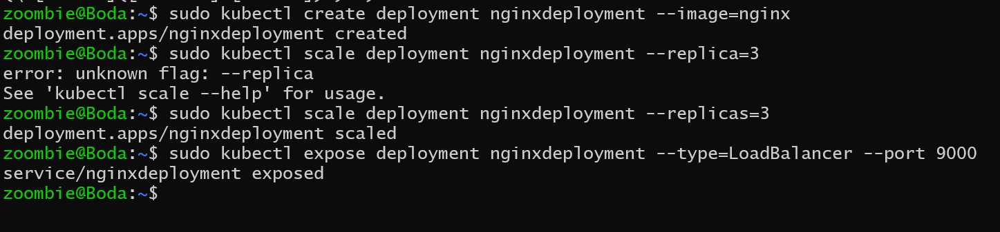
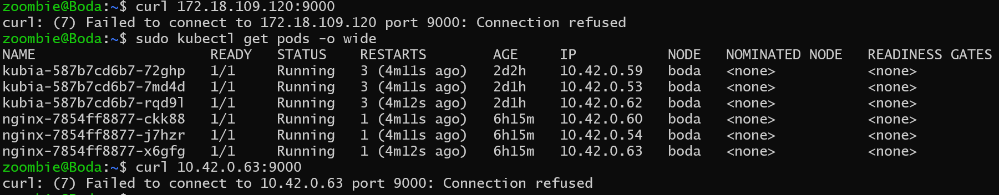
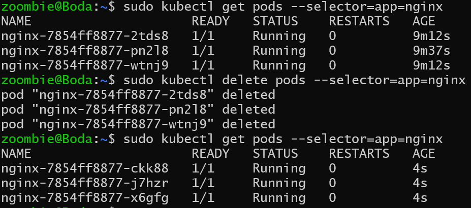

Create an nginx deployment in k8s with only 1 replica. scale the deployment to 3 replicas. expose the deployment with a ClusterIP service, try reaching the pods with both pod IP and service IP.
delete the pods of the deployment using a label selector and observe the result, try killing the main process of the **container** and observe.


- Create nginx deployment

  ```bash
  sudo kubectl create deployment nginx_deployment --image=nginx
  ```

- Scale the deployment to 3 replicas

  ```bash
  sudo kubectl scale deployment nginxdeployment --replicas=3
  ```

- expose the deployment with a ClusterIP service

  ```bash
  sudo kubectl expose deployment nginxdeployment --type=LoadBalancer --port 9000
  ```

    <p align="center">
    
    </p>

- When I talk to the service

    <p align="center">
    
    </p>

- When I try to delete pods, let's see what happens
  ```bash
  # to delete all pods from specific deployment
  sudo kubectl delete pods --selector=app=nginx
  ```
    <p align="center">
    
    </p>
