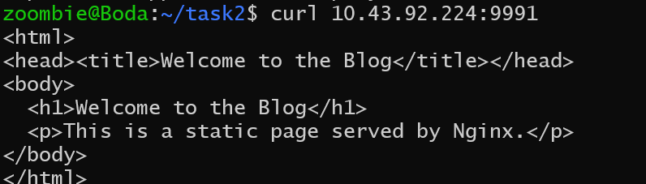
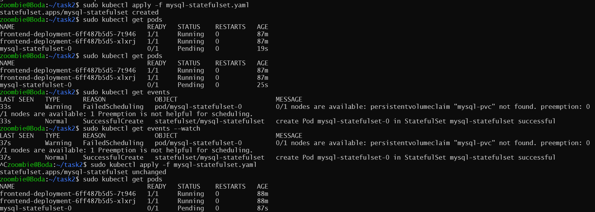
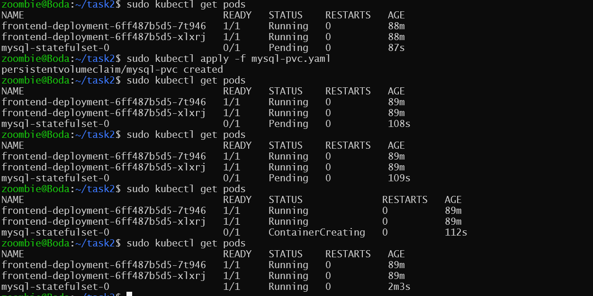
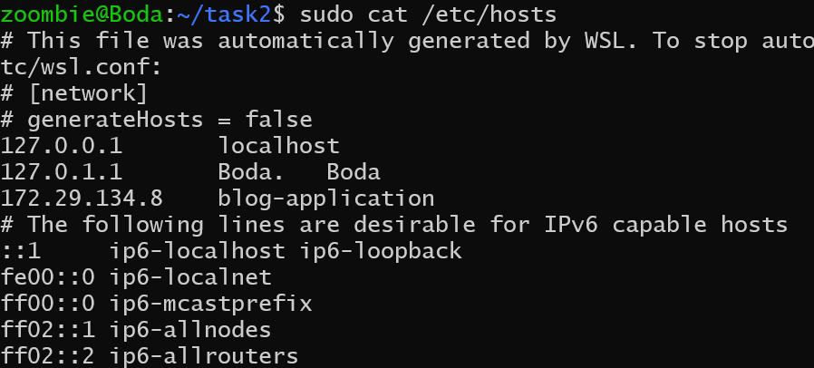
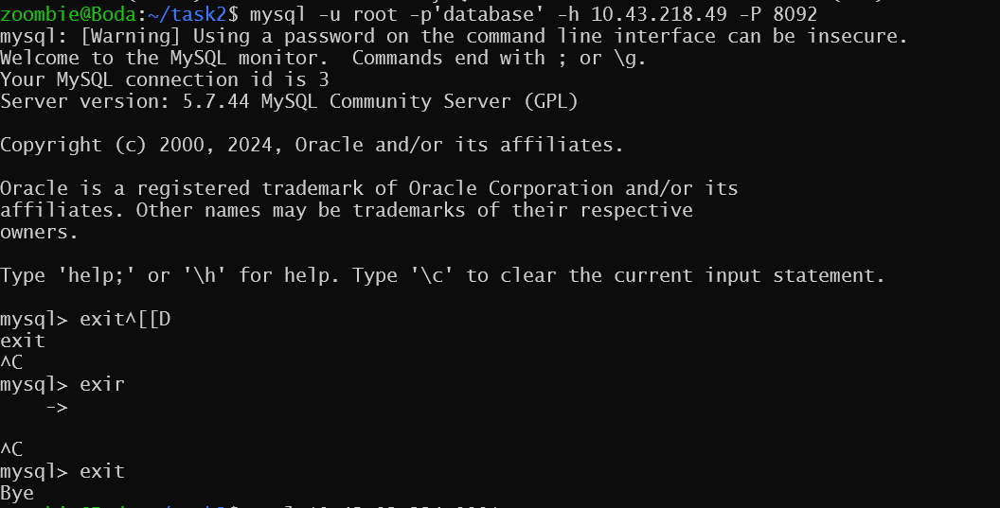
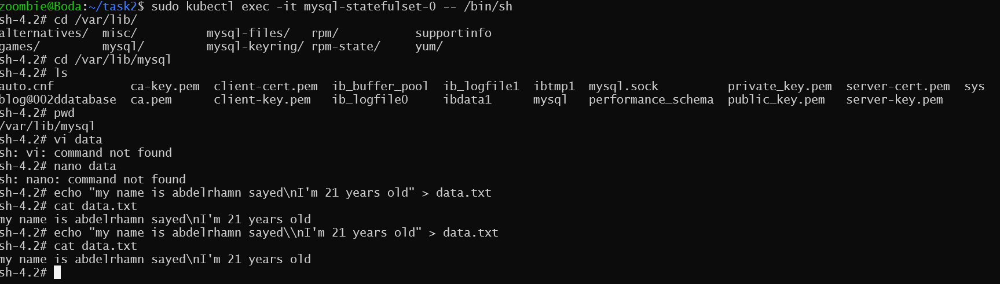
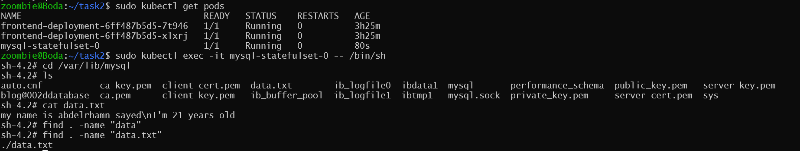
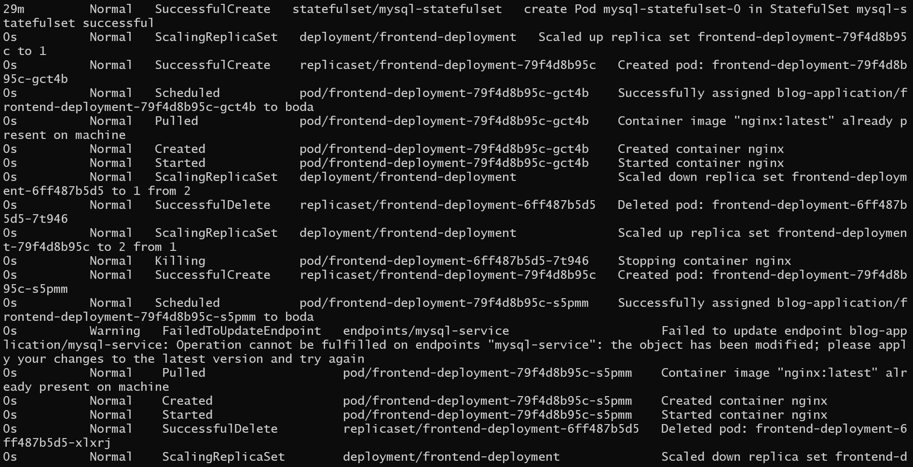
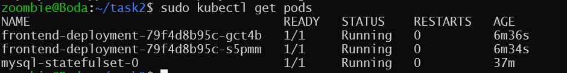

## First component => Frontend

**Manifests**

- [frontend-deployment](./manifests/frontend-deployment.yaml)
- [frontend-service](./manifests/frontend-deployment.yaml)
- [frontend-ingress](./manifests/frontend-ingress.yaml)
- [config-frontend](./manifests/config-frontend.yaml)

### Accessibility to the frontend service

**Command:**

```bash
curl 10.43.92.224:9991
```

**Output:**

  <p align="center">
    
    </p>

**how ???**

he Service uses the label selector app: blog to find the correct pods.

## Second component => Configuration and Secrets

**Manifests**

- [mysql-secret](./manifests/mysql-secret.yaml)
- [mysql-config](./manifests/mysql-config.yaml)

## Third component => Storage

- [mysql-pvc](./manifests/mysql-pvc.yaml)

## Fourth component => Backend

- [mysql-service](./manifests/mysql-service.yaml)
- [mysql-statefulset](./manifests/mysql-statefulset.yaml)

<p align="center">

</p>

<p align="center">

</p>

If you check these images, you will notice that the backend pod does not work until the PVC is functioning

**Verification:**

- Test the deployment by accessing the blog frontend through the Ingress.❌

  - First, retrieve the ClusterIP of the Ingress for the frontend-service:\*\*

    <p align="center">
        
        </p>

  - Second, add the ClusterIP and domain name to the /etc/hosts file.

    <p align="center">
        
        </p>

  - Third, access the Ingress resource.
      <p align="center">
      
      </p>

- confirming that the backend MySQL database is functioning correctly.✅
    <p align="center">
    
    </p>
    <p align="center">
    
    </p>
- Ensure all resources are properly labeled.✅

- PVCis correctly attached to the backend, preserving data across pod restarts.✅

  - Add the file `data.txt`
    <p align="center">
        

  - Delete the pods associated with the mysql-statefulset
     <p align="center">
        
  - Check the file after deleting the pod and when the pod restarts

    <p align="center">
            

- Also, simulate an update to the frontend by changing the image version (e.g., nginx:alpine to nginx:latest) and ensure the update rolls out smoothly without downtime.✅

  - After changing the image for the container in the frontend-deployment manifest and applying this manifest, using the following command:

    ```bash
        sudo kubectl apply -f frontend-deployment.yaml
    ```

  - Monitoring the events while reapplying the manifest.

    <p align="center">
    

  - The pods now

    <p align="center">
    

- Simulate increased traffic to trigger the HPA, and verify that the frontend scales appropriately.
